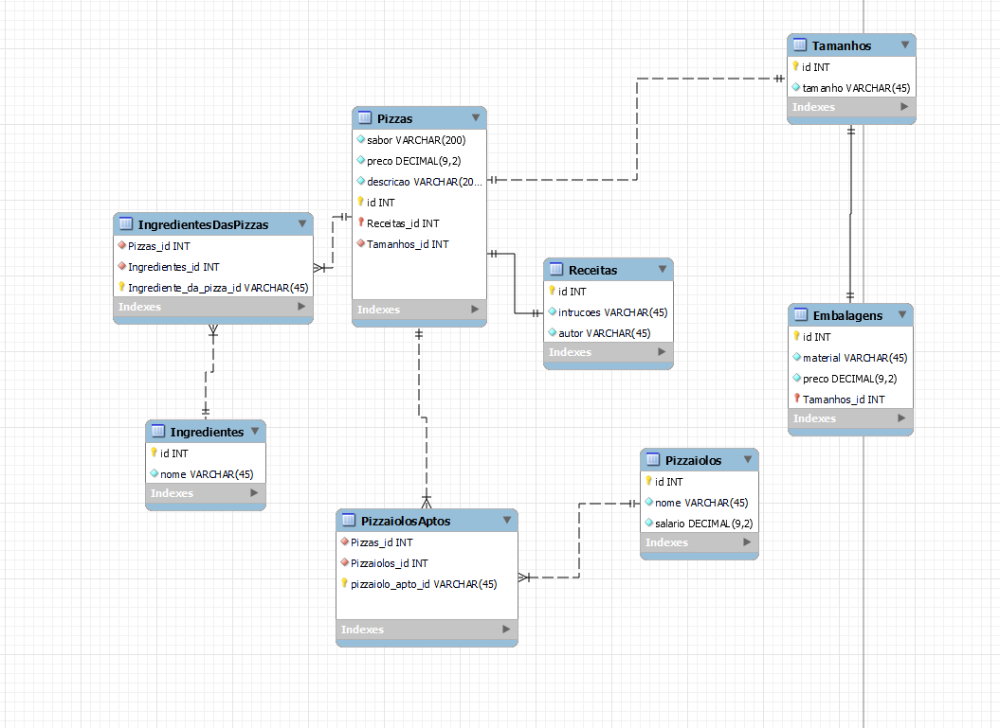

# pizzaria



Criando tabela de pizzas

```
CREATE TABLE pizzas (
    id INT PRIMARY KEY AUTO_INCREMENT,
    sabor VARCHAR(200),
    preco DECIMAL(9,2),
    descricao VARCHAR(200),
    receita_id INT,
    tamanho_id INT,
    FOREIGN KEY (receita_id) REFERENCES receitas(id),
    FOREIGN KEY (tamanho_id) REFERENCES tamanhos(id)
);
```


Criando tabela de tamanhos

```
CREATE TABLE tamanhos 
(
    id INT PRIMARY KEY AUTO_INCREMENT,
    tamanho VARCHAR(45)
);
```


Criando tabela de receitas

```
CREATE TABLE receitas
(	
    id INT PRIMARY KEY AUTO_INCREMENT,
    instrucoes VARCHAR(45),
    autor VARCHAR(45)
);
```


Criando tabela de embalgens

```
CREATE TABLE embalagens
(	
id INT PRIMARY KEY AUTO_INCREMENT,
    material VARCHAR(45),
    preco DECIMAL(9,2),
    tamanho_id INT,
    FOREIGN KEY (tamanho_id) REFERENCES tamanhos(id)
);
```


Criando tabela de pizzaiolos

```
CREATE TABLE pizzaiolos
(	
    id INT PRIMARY KEY AUTO_INCREMENT,
    nome VARCHAR(45),
    salario DECIMAL(9,2)
);
```


Criando tabela de ingredientes 

```
CREATE TABLE ingredientes
(	
id INT PRIMARY KEY AUTO_INCREMENT,
    nome VARCHAR(45)
);
```


Criando tabela dos pizzaiolos aptos para cada pizza

```
CREATE TABLE pizzaiolosAptos
(	
id INT PRIMARY KEY AUTO_INCREMENT,
    pizzaiolo_id INT,
    pizza_id INT,
        FOREIGN KEY (pizzaiolo_id) REFERENCES pizzaiolos(id),
    FOREIGN KEY (pizza_id) REFERENCES pizzas(id)
);
```


Criando tabela de ingredientes de cada pizza

```
CREATE TABLE ingredienteDaPizza (
    id INT PRIMARY KEY AUTO_INCREMENT,
    ingrediente_id INT,
    pizza_id INT,
    FOREIGN KEY (ingrediente_id) REFERENCES ingredientes(id),
    FOREIGN KEY (pizza_id) REFERENCES pizzas(id)
);
```


Inserindo dados na tabela tamanhos

```
INSERT INTO tamanhos (tamanho) VALUES
('Pequeno'),
('Médio'),
('Grande'),
('Extra Grande'),
('Médio Grande');
```


Inserindo dados na tabela receitas

```
INSERT INTO receitas (instrucoes, autor) VALUES
('Instruções para a Receita 1', 'Autor 1'),
('Instruções para a Receita 2', 'Autor 2'),
('Instruções para a Receita 3', 'Autor 3'),
('Instruções para a Receita 4', 'Autor 4'),
('Instruções para a Receita 5', 'Autor 5');
```


Inserindo dados na tabela embalagens

```
INSERT INTO embalagens (material, preco, tamanho_id) VALUES
('Embalagem 1', 5.99, 1),
('Embalagem 2', 7.99, 2),
('Embalagem 3', 9.99, 3),
('Embalagem 4', 11.99, 4),
('Embalagem 5', 13.99, 5);
```


Inserindo dados na tabela pizzaiolos

```
INSERT INTO pizzaiolos (nome, salario) VALUES
('Pizzaiolo 1', 1500.00),
('Pizzaiolo 2', 1600.00),
('Pizzaiolo 3', 1700.00),
('Pizzaiolo 4', 1800.00),
('Pizzaiolo 5', 1900.00);
```


Inserindo dados na tabela ingredientes

```
INSERT INTO ingredientes (nome) VALUES
('Queijo'),
('Pepperoni'),
('Cogumelos'),
('Tomate'),
('Molho de Tomate'),
('Frango'),
('Cebola'),
('Pimenta'),
('Bacon');
```

Inserindo dados na tabela pizzas

```
INSERT INTO pizzas (sabor, preco, descricao, receita_id, tamanho_id) VALUES
('Pizza Margherita', 12.99, 'Uma deliciosa pizza com queijo, tomate e manjericão.', 1, 2),
('Pizza Pepperoni', 14.99, 'Pizza de pepperoni com queijo derretido.', 2, 3),
('Pizza Vegetariana', 13.99, 'Pizza saudável com cogumelos, pimentão e azeitonas.', 3, 1),
('Pizza Frango com Bacon', 15.99, 'Uma pizza com frango, bacon e queijo.', 4, 1),
('Pizza Vegana', 13.49, 'Uma pizza vegana com cogumelos e cebola.', 5, 3);
```

Inserindo dados na tabela pizzaiolosAptos

```
INSERT INTO pizzaiolosAptos (pizzaiolo_id, pizza_id) VALUES
(1, 3),
(2, 5),
(3, 1),
(4, 2),
(5, 4);
```

Inserindo dados na tabela ingredienteDaPizza

```
INSERT INTO ingredienteDaPizza (ingrediente_id, pizza_id) VALUES
(1, 1),
(4, 1),
(5, 1),
(2, 2),
(5, 2),
(1, 3),
(3, 3),
(4, 3),
(5, 3),
(1, 4),
(8, 4),
(1, 5),
(6, 5);
```

Crie um relatório com todas as pizzas e os pizzaiolos aptos a produzi-las

```
SELECT
    pizzas.id AS pizza_id,
    pizzas.sabor AS sabor_da_pizza,
    pizzas.descricao AS descricao_da_pizza,
    pizzaiolos.id AS pizzaiolo_id,
    pizzaiolos.nome AS nome_do_pizzaiolo
FROM pizzas 
JOIN pizzaiolosAptos ON pizzas.id = pizzaiolosAptos.pizza_id
JOIN pizzaiolos ON pizzaiolosAptos.pizzaiolo_id = pizzaiolos.id;
```

Crie um relatório com todas as pizzas e seus ingredientes

```
SELECT 
	pizzas.id AS pizza_id,
    pizzas.sabor AS pizza_sabor,
    ingredientes.id AS ingrediente_id,
    ingredientes.nome AS ingrediente_nome
FROM pizzas JOIN ingredienteDaPizza ON pizzas.id = ingredienteDaPizza.pizza_id
JOIN ingredientes ON ingredienteDaPizza.ingrediente_id = ingredientes.id
ORDER BY pizza_id; 
```

Crie um relatório com todos os ingredientes e as pizzas onde são utilizados

```
SELECT 
    ingredientes.id AS ingrediente_id,
    ingredientes.nome AS ingrediente_nome,
	pizzas.id AS pizza_id,
    pizzas.sabor AS pizza_sabor
FROM pizzas JOIN ingredienteDaPizza ON pizzas.id = ingredienteDaPizza.pizza_id
JOIN ingredientes ON ingredienteDaPizza.ingrediente_id = ingredientes.id ORDER BY ingrediente_id;
```

Crie um relatório com os sabores de todas as pizzas, o nome dos pizzaiolos que
as fazem e as instruções para produzi-las

```
SELECT
    pizzas.id AS pizza_id,
    pizzas.sabor AS sabor_da_pizza,
    receitas.instrucoes AS instrucao_da_receita,
    receitas.id AS receita_id,
    pizzaiolos.id AS pizzaiolo_id,
    pizzaiolos.nome AS nome_do_pizzaiolo
FROM pizzas 
JOIN receitas ON pizzas.receita_id = receitas.id
JOIN pizzaiolosAptos ON pizzas.id = pizzaiolosAptos.pizza_id
JOIN pizzaiolos ON pizzaiolosAptos.pizzaiolo_id = pizzaiolos.id;
```
